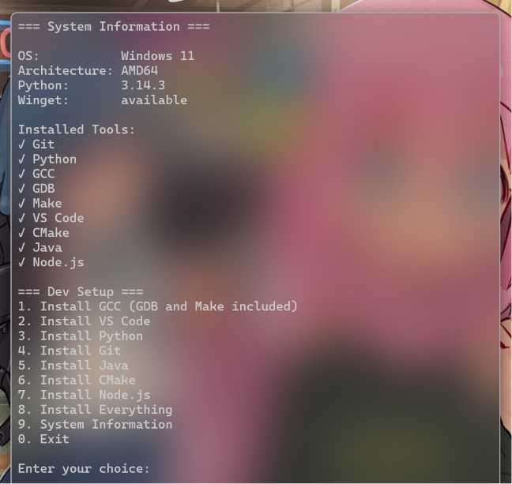

# Dev Setup

Automated setup tool for programming languages, compilers, and development environments.



## Features

- Windows and Linux support
- Git Installer
- VS Code Installer
- GCC Installer
- Python Installer 
- Cmake Installer
- Java Installer
- Node.js Installer

## Roadmap

- Flutter Support
- MacOS Support

## Installation & Getting Started

### Prerequisites

- Your OS/Distro's built in package manager (e.g. Winget on Windows and apt for debian based)
- [**Python 3.x**](https://www.python.org/downloads/)
- [**Pip**](https://pip.pypa.io/en/stable/installation/)


### Quick Start

Clone this repository and run the setup script:

For Windows
```bash
# Clone the repository
git clone https://github.com/TaH00R/dev_setup.git
cd dev_setup

# Install required dependencies
pip install -r requirements.txt

# Start the interactive setup menu
python main.py
```

For Linux
```bash
# Clone the repository
git clone https://github.com/TaH00R/dev_setup.git
cd dev_setup

# Install required dependencies
pip install -r requirements.txt

# Start the interactive setup menu
python3 main.py
```

## Usage

When you run `python main.py`, you will be presented with an interactive command-line interface:

```text
=== Dev Setup ===
1. Install GCC
2. Install VS Code
3. Install Python
4. Install Git
5. Install Java
6. Install CMake
7. Install Node.js
8. Install Everything
9. System Information
0. Exit

Enter your choice:
```
Using 0-9 input select desired package or install everything get a full system ready (not recommended as unused packages do pile up to waste storage).

### Running Tests Locally

The codebase has robust unit tests covering the installers, system info detection, logging, and error handling. You can run the test suite using Python's built-in `unittest` framework:

```bash
python -m unittest discover -s tests -v
```

### GitHub Actions CI

A continuous integration (CI) pipeline is set up via GitHub Actions. On every push and pull request to the `main` branch, the CI runner automatically:
1. Installs Python and updates dependencies.
2. Performs a syntax check using `compileall` across the files.
3. Lints the codebase using `ruff`.
4. Runs the entire unit test suite.


## Contributing

Contributions are welcome!
Check the Issues tab for beginner-friendly tasks.

If you want to contribute, please check [CONTRIBUTING.md](file:///c:/Users/ashwitha%20mobiles/Downloads/dev_setup-main/CONTRIBUTING.md) and see the list of open issues.
